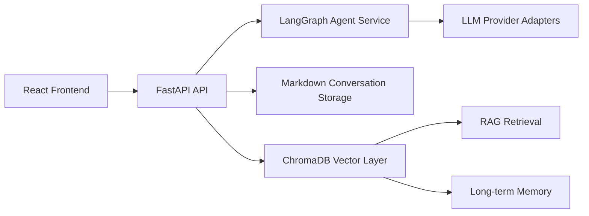

# Lex Mint

Developer-first AI agent workspace built with FastAPI, React, and LangGraph.

[Chinese README](README.zh-CN.md) | [Current Features Summary](docs/current_features_summary.md)


## Why Lex Mint

Lex Mint focuses on practical AI workflows for developers:

- Transparent storage: conversations are Markdown files you can read, diff, and back up.
- Strong daily UX: edit messages, branch sessions, folder organization, full-text search.
- Model control: per-session parameter overrides, reasoning depth, and cost tracking.
- Built-in knowledge workflows: RAG knowledge bases, memory injection, and source-aware responses.
- Developer workspace: project file explorer + AI chat in one place.

## Core Features

- **Chat and sessions**
  - Streaming chat (SSE), file attachments, regenerate/edit/delete messages
  - Session branching, duplicate/copy/move, folder grouping with drag and drop
  - Export to Markdown, import from ChatGPT (`.json/.zip`) and Markdown
  - Full-text search across sessions, context compression, auto title generation
- **Model and assistant system**
  - Multi-provider model management (DeepSeek, OpenRouter, OpenAI, Anthropic, Ollama, XAI)
  - Assistant CRUD, per-session param overrides, model comparison mode
  - Usage and cost tracking
- **Knowledge and memory**
  - Knowledge base CRUD with document processing and vector retrieval
  - Supported document types: TXT, MD, PDF, DOCX, HTML
  - Global + assistant-scoped memory with retrieval and injection
- **Tools**
  - Built-in web search + webpage extraction
  - In-chat translation (streaming) and TTS playback
- **Frontend experience**
  - React 19 + Tailwind 4 UI
  - i18n (`en`, `zh-CN`)
  - Command palette (`Ctrl/Cmd + K`)

## Architecture



## Quick Start

### Option A: Windows one-click scripts

1. Copy `.env.example` to `.env`
2. Set `DEEPSEEK_API_KEY` in `.env`
3. Run `install.bat`
4. Run `start.bat`

### Option B: Manual development

Backend (Windows, use venv executables directly):

```powershell
./venv/Scripts/pip install -r requirements.txt
./venv/Scripts/uvicorn src.api.main:app --reload --port 8988
```

Frontend:

```powershell
cd frontend
npm install
npm run dev
```

Open:

- App: `http://localhost:5173`
- API docs: `http://localhost:8988/docs`

## Environment Variables

| Variable | Required | Description |
|---|---|---|
| `DEEPSEEK_API_KEY` | Yes | Required base LLM key |
| `API_PORT` | No | Backend port (default in `.env.example`) |
| `CORS_ORIGINS` | No | Comma-separated allowed origins |
| `PROJECTS_BROWSE_ROOTS` | No | Allowed server-side roots for project picker |
| `LANGCHAIN_API_KEY` | No | Optional LangSmith tracing |

## Repository Layout

```text
src/                    FastAPI backend (API, services, agents, providers)
frontend/               React + Vite frontend
tests/                  Pytest suite
config/                 defaults/local runtime config
conversations/          Markdown chat storage
data/state/             Runtime state files
docs/                   Architecture and analysis docs
```

## Docs

- `docs/current_features_summary.md` - current capability snapshot
- `docs/api_endpoints.md` - API endpoint overview
- `docs/project_management.md` - project workspace notes
- `docs/cherry_studio_analysis.md` / `docs/lobehub_analysis.md` / `docs/open_webui_analysis.md` - comparative analysis

## Testing

```powershell
./venv/Scripts/pytest
```

Frontend checks:

```powershell
cd frontend
npm run lint
```

## Roadmap (short)

- Dockerized deployment
- Auth and permissions for multi-user scenarios
- MCP client support
- STT voice input
- Richer RAG quality loop (rerank + hybrid retrieval + eval)

## Security Note

This project is currently optimized for local/dev usage. Add authentication and deployment hardening before exposing it publicly.
